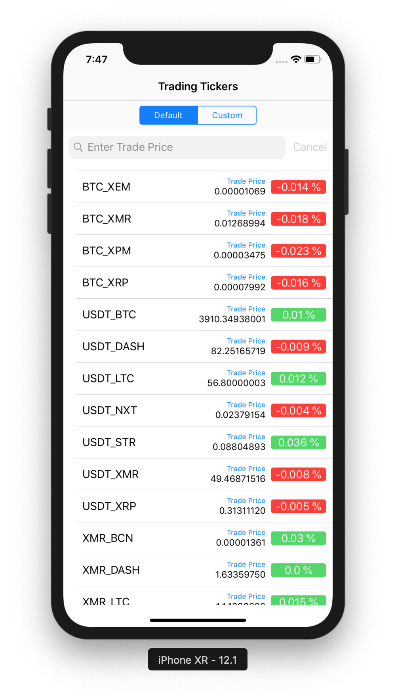
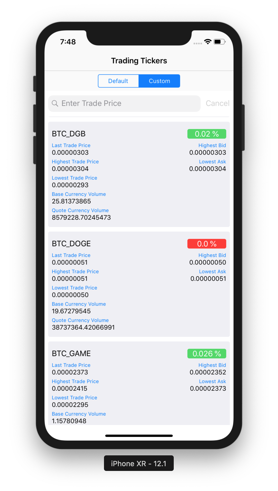

# BitTicker
A Stock Exchange Ticker Data App

## Getting Started

These instructions will get you a copy of the project up and running on your local machine for development and debugging purposes.

### Prerequisites

Application is using CocoaPods for dependency management. In order to install CocoaPods run following command on Terminal:

```
$ sudo gem install cocoapods
```
See [Getting Started on CocoaPods](https://guides.cocoapods.org/using/getting-started.html) for more informaiton.


### Installing
- Open Terminal and run following command to install pods:
```
$ pod install
```
- Navigate to project directory and open project using *BitTicker.xcworkspace*
- Build and run the application on simulator or actual device running iOS 12.0 or later using Xcode 10.1

## User Guidelines
- On launching the application, simply sign up, if using the app for the first time. Or Login if already signed up using previous credentials.
- After authentication is done, app will start loading Stock Tickers and display in two different layouts Default and Custom views.
- On entering trade price in search bar, up/down arrows are displayed as prefix in default view, and as suffix to the ticker name in custom view.

## Technical Notes
- For Architecture purpose MVVM & RxSwift are being used.
- App is partially complient to SOLID principles. 
- CoreData is used for persistence mechanism.
- App has two view components, Default and Custom.
- As default UI component `UITableView` is used for displaying tickers in tabular form.
- As custom UI component `UICollectionView` is used for displaying tickers in grid form.
- Tickers are automatically refreshed as app listnes via websocket.

### Third Party
- RxSwift is used to hide boilerplate code of `NSFetchedResultsController`
- AXReachability is used for network monitoring
- SwiftyBeaver is used for Logging.
- SwiftLint is integrated for autmatic code indentation.
- Starscream is used for Web sockets communication.


## Sample Screens



See Application Video here:  [app-preview.mp4](Screenshots/app-preview.mp4)

## Built With

* [CocoaPods](https://cocoapods.org/) - Dependency Management

## Versioning

Version 1.0
For more information on versioning, see [Semantic Versioning](http://semver.org/).

## Authors

* **Ahmad Ansari** - (https://github.com/ahmadansari)

## License

This project is licensed under the MIT License - see the [LICENSE.md](LICENSE.md) file for details

